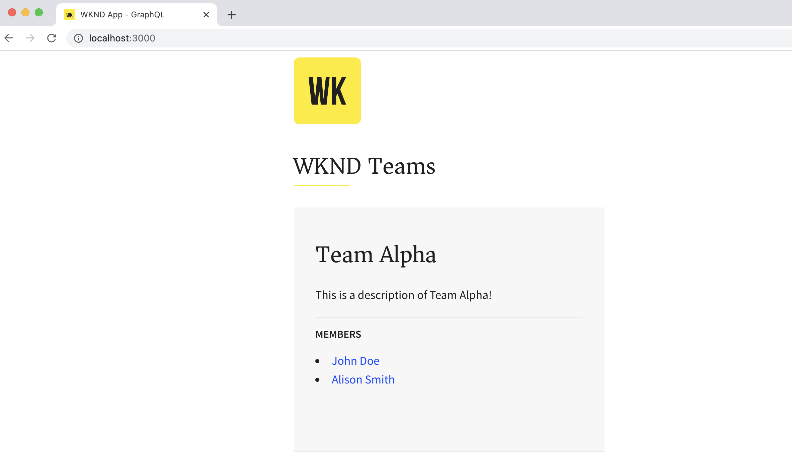

# React App - Basic Tutorial - Team+Persons

A basic React application that highlights Adobe Experience Manager's GraphQL APIs and the [AEM Headless Client for JavaScript](https://github.com/adobe/aem-headless-client-js).

This project was bootstrapped with [Create React App](https://github.com/facebook/create-react-app).



## Tutorial

A corresponding [tutorial](https://experienceleague.adobe.com/docs/experience-manager-learn/getting-started-with-aem-headless/graphql/multi-step/overview.html?lang=en) is available where you can learn how to setup and run the application to query data from an AEM environment using GraphQL.

## How to use

1. On the target AEM environment install the `tutorial-solution-content.zip` from the [Solution Files](https://experienceleague.adobe.com/docs/experience-manager-learn/getting-started-with-aem-headless/graphql/multi-step/explore-graphql-api.html?lang=en#solution-files) using [Package Manager](http://localhost:4502/crx/packmgr/index.jsp).
1. Update the [environment variables](#update-environment-variables) to point to your target AEM instance and add authentication (if needed)
1. Download and install [Node.js](https://nodejs.org/en/) and [npm](https://www.npmjs.com/)
1. Start the app from the command line:

    ```shell
    $ cd aem-guides-wknd-graphql/basic-tutorial
    $ npm install
    $ npm start
    ```

## System Requirements

 AEM as a Cloud Service | AEM 6.5 | Sample Content | Node   | npm | 
------------------------|---------|--------------------|---------|-----|
Continual               | 6.5.13+ |  [Solution Files](https://experienceleague.adobe.com/docs/experience-manager-learn/getting-started-with-aem-headless/graphql/multi-step/explore-graphql-api.html?lang=en#solution-files) | 10+  | 6+

## Notes

### Update Environment Variables

Several [environment variables](https://create-react-app.dev/docs/adding-custom-environment-variables) are used by this project to connect to an AEM environment. Default connects to an AEM **author** environment running at http://localhost:4502. If you wish to change this behavior update the `.env.development` file accordingly:

* `REACT_APP_HOST_URI=http://localhost:4502` - Set to AEM target host
* `REACT_APP_GRAPHQL_ENDPOINT=/content/_cq_graphql/my-project/endpoint.json` - Set the GraphQL endpoint path
* `REACT_APP_AUTH_METHOD=` - The preferred authentication method.
  * `service-token` - use Service token exchange for Cloud Env PROD
  * `dev-token` - use Dev token for local development with Cloud Env
  * `basic` - use user/pass for local development with Local Author Env
  * leave blank to use no authentication method
* `REACT_APP_BASIC_AUTH_USER=admin` - set basic auth user credentials to use if connecting to an AEM Author environment (for development only). If connecting to a Publish environment, this setting is not necessary.
* `REACT_APP_BASIC_AUTH_PASS=admin` - set the basic auth password used for connecting to an AEM Author environment (for development only). If connecting to a Publish environment, this setting is not necessary.
* `REACT_APP_DEV_TOKEN` - Dev token string. To connect to remote instance, you can use Bearer auth with a local [DEV token from Cloud console](https://experienceleague.adobe.com/docs/experience-manager-learn/getting-started-with-aem-headless/authentication/local-development-access-token.html)
* `REACT_APP_SERVICE_TOKEN` - Path to service token file. To connect to remote instance, authentication can be done with [Service token also (download file from Cloud console)](https://experienceleague.adobe.com/docs/experience-manager-learn/getting-started-with-aem-headless/authentication/service-credentials.html)

### Proxy API Requests

When using the webpack development server (`npm start`) the project relies on a [proxy setup](https://create-react-app.dev/docs/proxying-api-requests-in-development/#configuring-the-proxy-manually) using `http-proxy-middleware`. The file is configured at [src/setupProxy.js](src/setupProxy.js) and relies on several custom environment variables set at `.env` and `.env.development`.

If connecting to an AEM author environment, the corresponding authentication method needs to be configured.

### CORS - Cross Origin Resource Sharing

The proxy method for local development avoids any CORS issues since all of the requests in the browser appear to be from the same origin. When running a production version of the app this will not be the case.

Several CORS configurations must be set on the target AEM environment:

* OSGi CORS Configuration - A configuration can be deployed as part of an AEM project. [Example OSGi Config](https://github.com/adobe/aem-guides-wknd/blob/main/ui.config/src/main/content/jcr_root/apps/wknd/osgiconfig/config.publish/com.adobe.granite.cors.impl.CORSPolicyImpl~wknd-graphql.cfg.json#L21)
* Dispatcher headers - The AEM dispatcher must also be enabled to pass through the following client headers:

    ```
    "Origin"
    "Access-Control-Request-Method"
    "Access-Control-Request-Headers"
    ```

  * [Example cached headers](https://github.com/adobe/aem-guides-wknd/blob/main/dispatcher/src/conf.dispatcher.d/available_farms/wknd.farm#L102)
  * [Example client headers](https://github.com/adobe/aem-guides-wknd/blob/main/dispatcher/src/conf.dispatcher.d/clientheaders/clientheaders.any)


*This is a sample CORS config for Author environment if Proxy is set to False*

## Documentation

* [AEM Headless Tutorials](https://experienceleague.adobe.com/docs/experience-manager-learn/getting-started-with-aem-headless/overview.html)
* [AEM Headless Developer Journey](https://experienceleague.adobe.com/docs/experience-manager-cloud-service/headless-journey/developer/overview.html)
* [AEM Headless Client for JavaScript](https://github.com/adobe/aem-headless-client-js)


